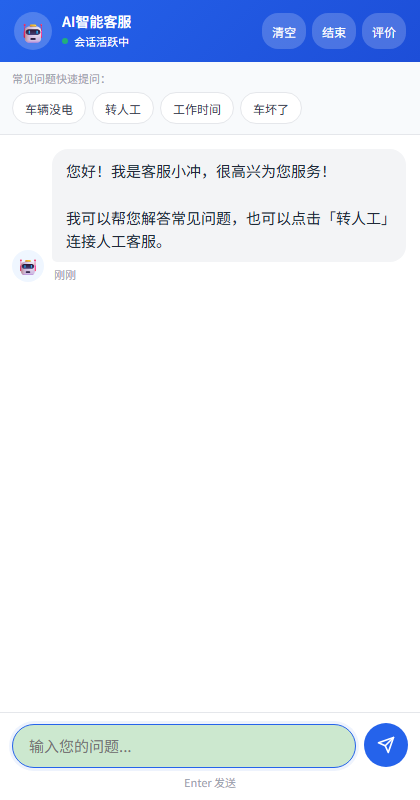
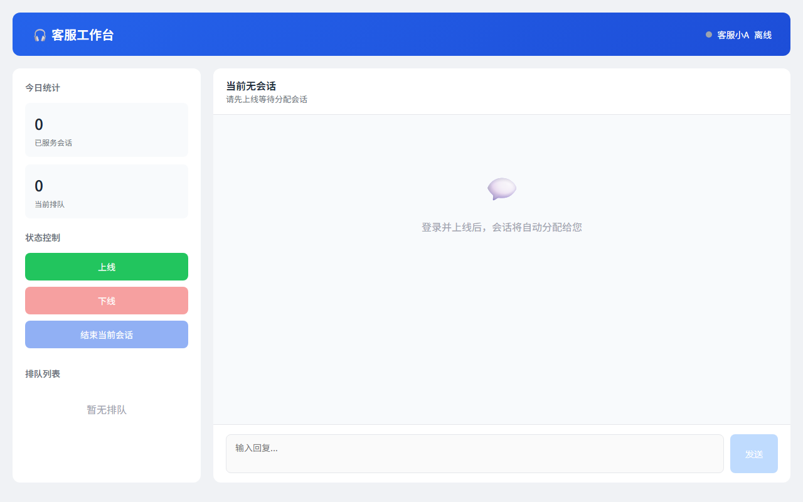
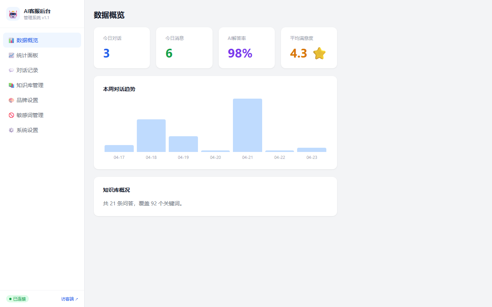
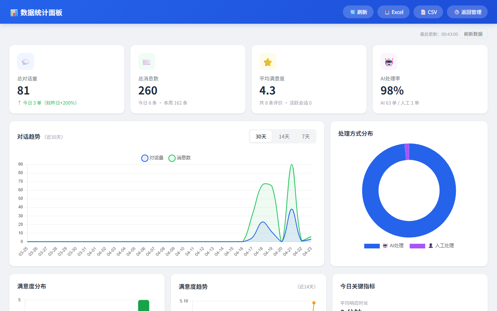

# WorkBuddy AI 智能客服系统

<p align="center">
  <strong>让中小企业用得起、用得好的私有化 AI 客服</strong><br>
  <code>v1.1.0</code> · Node.js · Express · SQLite · WebSocket
</p>

<p align="center">
  <a href="#快速开始">快速开始</a> ·
  <a href="#功能总览">功能</a> ·
  <a href="#技术架构">架构</a> ·
  <a href="#api-文档">API</a> ·
  <a href="#部署">部署</a>
</p>

---

## 这个项目是什么

面向 **1-3 人客服团队** 的中小企业，提供一套可私有部署的 AI 客服系统。核心价值：

> **用一顿饭的月成本，实现 7×24 小时自动接待。访客进来，AI 先答；答不了的，一键转人工。**
>
> 💡 **知识库命中策略**：优先匹配知识库，不调 API。实测节省 70%+ API 调用成本。

### 谁在用

| 场景 | 痛点 | 解法 |
|------|------|------|
| 小餐厅/奶茶店 | 高峰期咨询爆炸，漏单 | AI 自动接单，知识库覆盖常见问题 |
| 个体工商户 | 一个人撑店，没法守着手机 | 7×24 AI 值班，转人工排队通知 |
| 电商小团队 | 60% 重复问题浪费人力 | 知识库 + AI 过滤重复咨询 |
| 本地服务平台 | 产品/服务咨询多且杂 | 自定义知识库 + 品牌皮肤适配 |

---

## 功能总览

### 访客端



- 对话式接待，AI 自动回复知识库内问题
- 快捷问题按钮，降低提问门槛
- AI 答不了 → 一键转人工（排队 + 实时通知）
- 会话结束 → 满意度评价（1-5 星 + 评论）
- 移动端全屏适配，桌面端居中卡片样式

### 客服工作台



- 客服登录/上下线，WebSocket 实时通信
- 访客排队自动分配（FIFO）
- 正在处理的会话实时推送
- 会话结束自动流转到下一个排队用户
- 累计服务量统计

### 管理后台



| 模块 | 功能 |
|------|------|
| **数据概览** | 今日/昨日对比、会话趋势柱状图、关键指标卡片 |
| **统计面板** | 30 天趋势、AI 处理率、满意度分布、高频问题 TOP10、数据导出（XLSX/CSV） |
| **对话记录** | 全量会话列表、消息详情、状态筛选、分页浏览、导出 |
| **知识库管理** | CRUD、关键词搜索、批量导入（XLSX/CSV/JSON）、自动关键词提取、导出 |
| **品牌设置** | 名称/Logo/主题色/欢迎语/快捷问题/评价文案/热线电话，完整 UI 定制 |
| **敏感词管理** | 5 大分类（政治/色情/暴力/广告/欺诈）、用户输入 + AI 输出双向过滤、命中日志 |
| **系统设置** | AI 双接口切换（智谱 + DeepSeek）、API 连通性测试、System Prompt 自定义 |

### 数据统计



- 概览卡片：总对话、总消息、评价数、活跃会话
- 日趋势折线图（近 30 天）
- AI vs 人工处理方式饼图
- 满意度星级分布 + 日趋势
- 高频问题 TOP10
- 一键导出多 Sheet Excel

---

## 技术架构

```
┌─────────────────────────────────────────────────────┐
│                    Nginx / Caddy                      │
│                 反向代理 + SSL 终止                    │
└──────────────┬──────────────────┬────────────────────┘
               │                  │
       ┌───────▼───────┐  ┌──────▼──────┐
       │   Express +   │  │  WebSocket  │
       │   HTTP REST   │  │  (实时通信)  │
       └───────┬───────┘  └──────┬──────┘
               │                 │
       ┌───────▼─────────────────▼───────┐
       │          Route Layer            │
       │  chat · knowledge · config      │
       │  stats · human · sensitive      │
       └───────┬─────────────────────────┘
               │
       ┌───────▼───────┐
       │ Service Layer │
       │  ai.js        │ ◄── 智谱AI / DeepSeek
       │  knowledge.js │ ◄── 关键词匹配 + 评分
       │  human.js     │ ◄── 排队分配 + WS管理
       │  database.js  │ ◄── 会话/消息/评价/统计
       │  sensitive.js │ ◄── 5类敏感词过滤
       └───────┬───────┘
               │
       ┌───────▼───────┐
       │    SQLite     │
       │  (WAL 模式)   │
       │  会话·消息     │
       │  评价·知识库   │
       │  统计·敏感词   │
       └───────────────┘
```

### 技术选型

| 组件 | 选型 | 选型理由 |
|------|------|---------|
| Web 框架 | Express 4.x | 成熟稳定，生态丰富，中小项目最优解 |
| 实时通信 | ws (WebSocket) | 轻量原生，与 Express 同端口运行，无需额外服务 |
| 数据库 | better-sqlite3 | 同步 API、WAL 并发、零配置、单文件部署 |
| AI 接口 | 智谱 GLM-4-Flash + DeepSeek | 国内合规、按量计费、双接口互为降级备份 |
| 文件处理 | multer + xlsx (SheetJS) | 知识库批量导入/导出，支持 Excel 和 CSV |
| 认证 | HTTP Basic Auth | 管理后台轻量认证，生产环境可替换为 JWT |
| 部署 | Docker + Docker Compose | 一键部署，数据持久化，健康检查 |

### 安全机制

| 机制 | 说明 |
|------|------|
| **visitorId 白名单校验** | 正则 `^v_\d{10,}_[a-z0-9]{4,20}$`，防刷会话 |
| **WebSocket 鉴权** | 连接时校验 visitorId 与会话归属匹配 |
| **会话权限隔离** | 访客只能访问自己的会话，禁止跨会话操作 |
| **敏感词 AES 加密** | 用户输入内容加密存储，KEY 独立配置 |
| **API 限流** | 访客聊天 30次/分钟，管理接口 100次/分钟 |
| **敏感词双向过滤** | 用户输入 + AI 输出双重检测 |

### 设计决策

**为什么用 SQLite 而不是 MySQL/PostgreSQL？**

目标用户是中小企业，单机部署场景下 SQLite 性能足够（WAL 模式支持读写并发），且零运维成本——不需要安装数据库服务、不需要备份策略、不需要监控连接池。整个系统一个 `service.db` 文件带走。

**为什么前端不用 React/Vue？**

管理后台页面更新频率低，原生 HTML + CSS + JS 在这个场景下代码更少、加载更快、部署更简单。对于这个体量的 ToB 内部工具，引入框架的复杂度收益比是负的。

**为什么 AI 做双接口降级？**

智谱和 DeepSeek 在不同场景下各有优劣（速度、成本、效果），双接口互为备份可以避免单点故障。主接口不可用时自动切换到备用接口，保证 AI 回复的可用性。

**为什么知识库优先策略？**

知识库匹配时不调用 AI 接口，实测可节省 70%+ API 调用量。以日均 100 次咨询、知识库命中率 40% 计算，月均可节省约 60 元 API 费用。对于 FAQ 类场景，知识库策略是性价比最优解。

---

## 项目结构

```
ai-customer-service/
├── server/
│   ├── index.js                 # 入口：Express + WebSocket
│   ├── config/
│   │   └── auth.json            # 管理员/客服账号配置
│   ├── data/                    # 运行时数据（自动生成）
│   │   ├── service.db           # SQLite 数据库
│   │   ├── ai-config.json       # AI 接口配置
│   │   ├── brand.json           # 品牌皮肤配置
│   │   └── agents.json          # 客服账号数据
│   ├── middleware/
│   │   └── auth.js              # Basic Auth 中间件
│   ├── routes/                  # 6 个路由模块（48 个 API 端点）
│   │   ├── chat.js              # 访客聊天（9 端点）
│   │   ├── config.js            # 系统配置（10 端点）
│   │   ├── knowledge.js         # 知识库（8 端点）
│   │   ├── human.js             # 人工客服（8 端点）
│   │   ├── sensitive.js         # 敏感词（7 端点）
│   │   └── stats.js             # 数据统计（6 端点）
│   ├── services/                # 6 个业务服务
│   │   ├── sqlite.js            # SQLite 连接 + 表初始化
│   │   ├── database.js          # 会话/消息/评价/统计
│   │   ├── ai.js                # AI 聊天 + 双接口降级
│   │   ├── human.js             # 排队分配 + WebSocket 管理
│   │   ├── knowledge.js         # 知识库检索 + CRUD
│   │   └── sensitive.js         # 敏感词检测（5 分类）
│   └── utils/
│       └── config.js            # 配置读写工具
├── public/                      # 前端页面
│   ├── index.html               # 访客聊天（移动端优先）
│   ├── agent.html               # 客服工作台
│   ├── admin.html               # 管理后台（7 个功能模块）
│   ├── stats.html               # 数据统计仪表板
│   ├── knowledge_template.xlsx  # 知识库导入模板
│   └── knowledge_template.csv   # 知识库导入模板
├── docs/
│   └── screenshots/             # 页面截图
├── Dockerfile                   # Docker 多阶段构建
├── docker-compose.yml           # Docker Compose 编排
├── nginx.conf.example           # Nginx 反代配置模板
├── .env.example                 # 环境变量模板
├── .env.production              # 生产环境配置示例
├── .dockerignore                # Docker 构建排除
├── railway.json                 # Railway 部署配置
├── RAILWAY_DEPLOY.md            # Railway 部署指南
├── DEPLOYMENT.md                # 完整部署手册（含快速部署）
├── DEPLOY.md                    # Docker 快速部署
└── package.json
```

---

## 🚀 一键部署（免服务器）

### Railway（推荐，5分钟上线）

```bash
# 1. 用 GitHub 登录 https://railway.app
# 2. 上传代码到 GitHub
# 3. Railway → New Project → Deploy from GitHub
# 4. 配置环境变量：
#    DEEPSEEK_API_KEY=你的密钥
#    BASIC_AUTH=admin:你的密码
# 5. 完成！获得 HTTPS 地址
```

**免费额度：** 500小时/月，足够演示用

### Docker（一键启动）

```bash
docker run -d -p 3456:3456 \
  -e DEEPSEEK_API_KEY=你的密钥 \
  -e BASIC_AUTH=admin:你的密码 \
  -v ./data:/app/data \
  --name ai-customer \
  ghcr.io/你的用户名/ai-customer-service:latest
```

---

## 快速开始

### 环境要求

- Node.js >= 18
- npm >= 9

### 安装

```bash
git clone <your-repo-url>
cd ai-customer-service
npm install
```

### 配置 AI 接口

编辑 `server/data/ai-config.json`（首次启动自动生成），填入你的 API Key：

```json
{
  "zhipu": {
    "enabled": true,
    "apiKey": "your-zhipu-api-key",
    "model": "glm-4-flash"
  },
  "deepseek": {
    "enabled": true,
    "apiKey": "your-deepseek-api-key",
    "model": "deepseek-chat"
  },
  "defaultProvider": "zhipu"
}
```

> API Key 申请：[智谱AI](https://open.bigmodel.cn/) · [DeepSeek](https://platform.deepseek.com/)

### 启动

```bash
npm start
```

启动后访问：

| 端点 | 地址 | 说明 |
|------|------|------|
| 访客端 | http://localhost:3456 | 用户聊天入口 |
| 客服工作台 | http://localhost:3456/agent.html | 需要登录 |
| 管理后台 | http://localhost:3456/admin.html | 需要登录 |
| 数据统计 | http://localhost:3456/stats.html | 需要登录 |

### 默认账号

> ⚠️ 默认账号密码已移除，请参考 `.env.example` 配置。首次部署请登录管理后台修改密码。

---

## API 文档

系统共 **48 个 API 端点**，按模块划分如下。

### 认证

管理类 API 使用 HTTP Basic Auth 认证，访客聊天 API 无需认证。

```
Authorization: Basic base64(username:password)
```

### 访客聊天 `/api/chat`

| 方法 | 路径 | 说明 | 认证 |
|------|------|------|------|
| POST | `/api/chat` | 创建新会话 | ❌ |
| POST | `/api/chat/:id/message` | 发送消息 | ❌ |
| GET | `/api/chat/:id/messages` | 获取历史消息 | ❌ |
| GET | `/api/chat/:id` | 获取会话信息 | ❌ |
| POST | `/api/chat/:id/rate` | 评价会话 | ❌ |
| POST | `/api/chat/:id/close` | 关闭会话 | ❌ |
| POST | `/api/chat/:id/transfer` | 转人工 | ❌ |
| POST | `/api/chat/:id/cancel-queue` | 取消排队 | ❌ |
| GET | `/api/chat/export` | 导出对话记录 | ✅ |

### 知识库 `/api/knowledge`

| 方法 | 路径 | 说明 | 认证 |
|------|------|------|------|
| GET | `/api/knowledge` | 获取知识库列表 | ✅ |
| POST | `/api/knowledge` | 新增知识条目 | ✅ |
| PUT | `/api/knowledge/:id` | 更新知识条目 | ✅ |
| DELETE | `/api/knowledge/:id` | 删除知识条目 | ✅ |
| POST | `/api/knowledge/import` | 批量导入 (XLSX/CSV/JSON) | ✅ |
| GET | `/api/knowledge/export` | 导出 (JSON/XLSX/CSV) | ✅ |
| GET | `/api/knowledge/search` | 搜索知识库 | ✅ |
| POST | `/api/knowledge/reset` | 重置为默认数据 | ✅ |

### 人工客服 `/api/human`

| 方法 | 路径 | 说明 | 认证 |
|------|------|------|------|
| POST | `/api/human/login` | 客服登录 | ✅ |
| POST | `/api/human/online` | 上线 | ✅ |
| POST | `/api/human/offline` | 下线 | ✅ |
| GET | `/api/human/status` | 获取客服状态 | ✅ |
| POST | `/api/human/message` | 发送消息 | ✅ |
| POST | `/api/human/end` | 结束当前会话 | ✅ |
| GET | `/api/human/queue` | 获取排队信息 | ✅ |
| GET | `/api/human/agents` | 获取所有客服 | ✅ |

### 数据统计 `/api/stats`

| 方法 | 路径 | 说明 | 认证 |
|------|------|------|------|
| GET | `/api/stats/overview` | 总览数据 | ✅ |
| GET | `/api/stats/trend` | 日趋势（近 30 天） | ✅ |
| GET | `/api/stats/satisfaction` | 满意度分布 | ✅ |
| GET | `/api/stats/top-questions` | 高频问题 TOP N | ✅ |
| GET | `/api/stats/conversations` | 会话列表（分页） | ✅ |
| GET | `/api/stats/export` | 导出统计数据 | ✅ |

### 系统配置 `/api/config`

| 方法 | 路径 | 说明 | 认证 |
|------|------|------|------|
| GET | `/api/config/ai` | 获取 AI 配置 | ✅ |
| POST | `/api/config/ai` | 保存 AI 配置 | ✅ |
| POST | `/api/config/ai/test` | 测试 AI 连接 | ✅ |
| GET | `/api/config/brand/detail` | 获取品牌配置 | ✅ |
| POST | `/api/config/brand/save` | 保存品牌配置 | ✅ |
| POST | `/api/config/brand/reset` | 重置品牌配置 | ✅ |
| ... | | 共 10 个端点 | |

### 敏感词 `/api/sensitive`

| 方法 | 路径 | 说明 | 认证 |
|------|------|------|------|
| GET | `/api/sensitive` | 获取敏感词列表 | ✅ |
| POST | `/api/sensitive` | 新增敏感词 | ✅ |
| DELETE | `/api/sensitive/:id` | 删除敏感词 | ✅ |
| POST | `/api/sensitive/check` | 文本检测 | ✅ |
| ... | | 共 7 个端点 | |

---

## 部署

### Docker 一键部署（推荐）

```bash
docker compose up -d
```

详见 [DEPLOY.md](DEPLOY.md)

### 手动部署

从服务器选购到上线的完整操作手册：

详见 [DEPLOYMENT.md](DEPLOYMENT.md)（含 Nginx 配置、SSL、安全加固、运维命令）

### 环境变量

```bash
cp .env.example .env
# 编辑 .env 设置端口、密码等
```

---

## 核心机制

### AI 降级策略

```
用户提问
  │
  ├──► 知识库匹配（关键词评分 >= 2）
  │     └── 命中 → 直接返回知识库答案
  │
  ├──► 调用主 AI 接口（智谱/DeepSeek）
  │     ├── 成功 → 返回 AI 回答
  │     └── 失败 → 尝试备用接口
  │           ├── 成功 → 返回备用接口回答
  │           └── 失败 → 兜底回复
  │
  └──► 敏感词过滤（双向）
        ├── 用户输入 → 过滤后进入 AI
        └── AI 输出 → 过滤后返回用户
```

### 会话超时管理

| 阶段 | 触发条件 | 行为 |
|------|---------|------|
| Active → Idle | 5 分钟无消息 | 状态标记为空闲 |
| Idle → Closed | 10 分钟无消息 | 自动关闭，原因：timeout |
| 检查频率 | 每 30 秒 | 遍历所有未关闭会话 |

### 人工客服排队

```
用户请求转人工
  │
  ├── 有空闲客服 → 直接分配（实时 WebSocket 推送）
  │
  └── 全部忙碌 → 加入 FIFO 队列
        │
        ├── 客服结束当前会话 → 自动分配队首用户
        ├── 客服下线 → 当前会话重新入队
        └── 用户取消排队 → 从队列移除
```

---

## License

MIT

---

*最后更新：2026-04-26 · v1.1.0*
