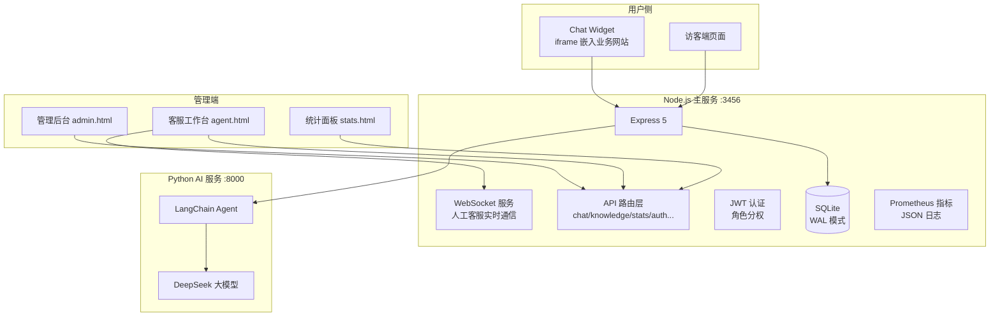

# AI智能客服系统（AI Customer Service）

一个**对标 Intercom Fin + 智齿科技**的 AI 客服 SaaS 演示项目。AI 优先 + 人机协同 + 知识库闭环，支持**一行代码嵌入任何网站**。

## 核心能力

| 能力 | 说明 |
|---|---|
| 🤖 **AI 智能对话** | 流式回复（SSE）、知识库命中 / AI 生成 / 兜底三层来源标签 |
| 📚 **知识库 RAG** | FTS5 全文检索 + 向量语义检索（Hybrid RRF 融合）、本地 Embedding fallback（零依赖） |
| 👤 **人工客服** | 转人工 / 排队 / WebSocket 实时聊天 / 客服上下线 / 会话分配 |
| ⭐ **评价闭环** | 星级 + 评论、满意度分布与趋势 |
| 📝 **未答知识闭环** | AI 无法回答自动记录 → 运营补充知识库 |
| 🚀 **Chat Widget** | Intercom 式，一行 `<script>` 嵌入任何业务网站 |
| 📊 **运营数据** | 12 KPI + 4 图表 + 2 列表，标准 SaaS 指标体系 |
| 🛡️ **安全** | JWT 认证 + 角色分权（admin/agent/readonly）、敏感词检测、Helmet 安全头 |
| 📈 **监控** | Prometheus 指标端点、结构化 JSON 日志（ELK 可对接） |
| 🐳 **部署** | Docker Compose 一键编排（Node + Python + PostgreSQL + Nginx） |

## 架构



**技术栈**：Node.js 22 + Express 5 + better-sqlite3 / PostgreSQL 16 + Python 3.12 + FastAPI + LangChain + DeepSeek + Chart.js + 原生 JS（零前端框架）

## 快速开始

### 一键启动（Windows 双击）

```bash
# 方式1：双击 start.bat（推荐）
start.bat

# 方式2：命令行
node start.js          # 启动全部服务
node start.js status   # 查看状态
node start.js stop     # 停止
```

### 生成演示数据（可选）

```bash
node scripts/seed-demo.js           # 生成 30 天模拟运营数据
node scripts/seed-demo.js --clean   # 清空
```

### 访问入口

| 入口 | 地址 | 登录 |
|---|---|---|
| 访客端 | http://localhost:3456 | 无需登录 |
| Chat Widget 演示 | http://localhost:3456/widget/demo-site.html | 无需登录 |
| 管理后台 | http://localhost:3456/admin.html | admin / admin123 |
| 客服工作台 | http://localhost:3456/agent.html | agent_001 / agent123 |
| 统计面板 | http://localhost:3456/stats.html | admin / admin123 |
| 能力地图 | http://localhost:3456/capabilities.html | 无需登录 |

## 目录结构

```
AI智能客服V3（node.js版）/
├── server/                  # Node.js 后端
│   ├── index.js             # 主入口（Express + WebSocket + 监控）
│   ├── routes/              # API 路由（chat/knowledge/stats/auth/human...）
│   ├── services/            # 业务服务（数据库/知识库/敏感词/AI）
│   ├── middleware/          # JWT 认证
│   ├── config/              # 用户配置（auth.json）
│   └── data/                # SQLite 数据库
├── ai-service-langchain/    # Python AI 服务（LangChain + DeepSeek）
├── public/                  # 前端（原生 HTML/CSS/JS）
│   ├── css/                 # 设计系统 theme.css + 各页面样式
│   ├── js/common.js         # 公共工具库
│   ├── widget/              # Chat Widget（chat.html/widget.js/demo-site.html）
│   └── *.html               # 访客端/管理后台/客服台/统计/能力地图
├── scripts/                 # 工具脚本（seed-demo.js 等）
├── db/migrations/           # PostgreSQL 迁移
├── docker-compose.yml       # 容器编排
└── start.js / start.bat     # 一键启动
```

## 部署（Docker）

```bash
cp .env.example .env   # 填入 DEEPSEEK_API_KEY
docker compose up -d   # 一键编排
```

## Chat Widget 接入

```html
<!-- 任何业务网站，一行代码接入 -->
<script src="https://你的域名/widget/widget.js" data-title="在线客服" data-logo="🤖"></script>

<!-- 全局 API -->
<script>
  CSWidget.open();                     // 展开
  CSWidget.send('你们的工作时间是几点？'); // 发消息
  CSWidget.setUser({ name: '张先生' });  // 传用户信息
</script>
```

## 配置说明

- **品牌设置**：管理后台 → 品牌设置（名称/Logo/主题色/快捷问题/欢迎语，实时生效）
- **AI 模型**：管理后台 → 系统设置（DeepSeek/智谱 API Key）
- **敏感词**：管理后台 → 敏感词管理（分类 + 检测测试）
- **账号**：`server/config/auth.json`（admin/agent/viewer）+ `server/data/agents.json`（人工客服）

## 免责声明

演示项目，默认账号密码仅供本地演示使用，生产部署请务必修改。
